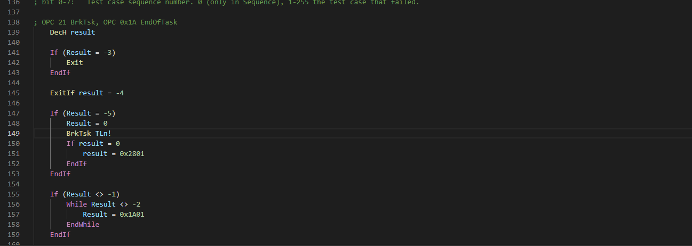

# EXOL-plugin README

This is a plugin for Visual Studio Code that adds syntax highlighting and some snippets to the EXOL language. Contributions are welcome.

## Building

To build a .vsix file, run `vsce package` in the terminal.

## Installing

To install a .vsix file, go to the extensions tab, press the `...` button and 'Install from vsix'.